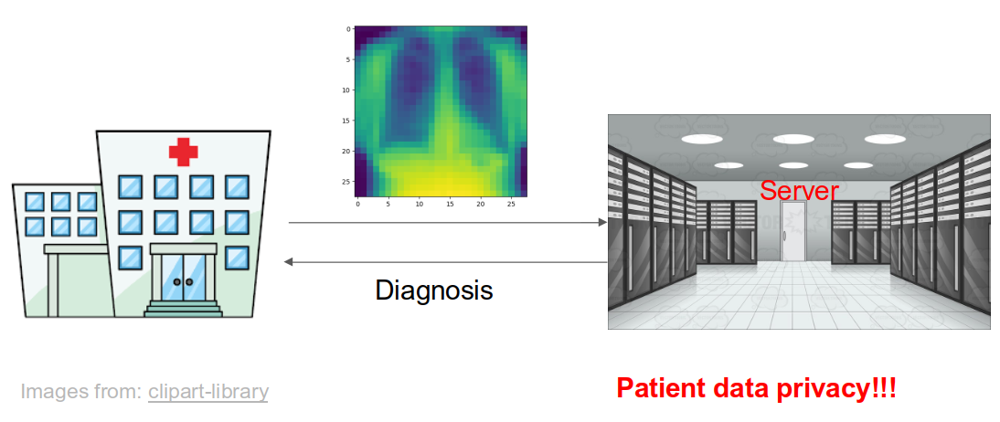
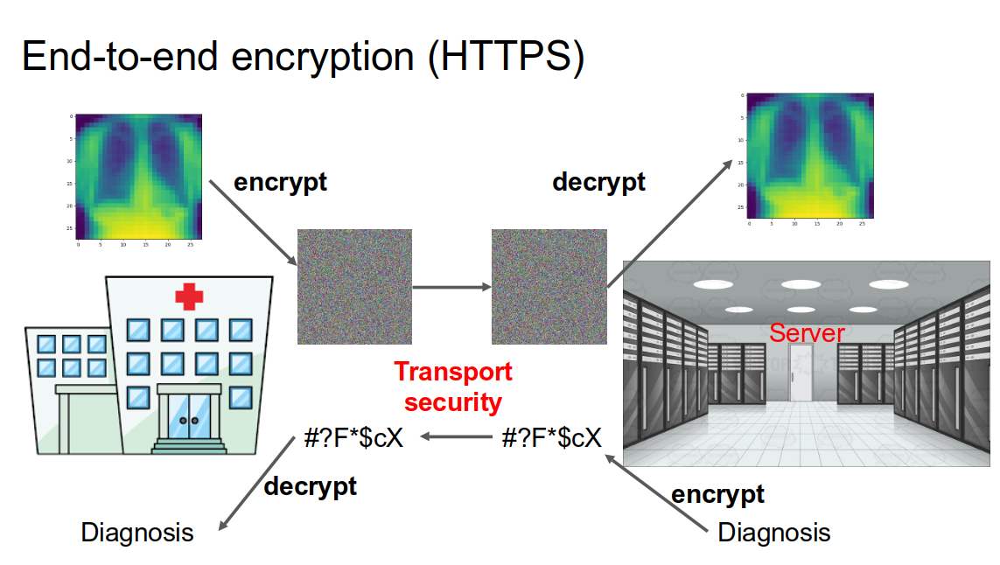
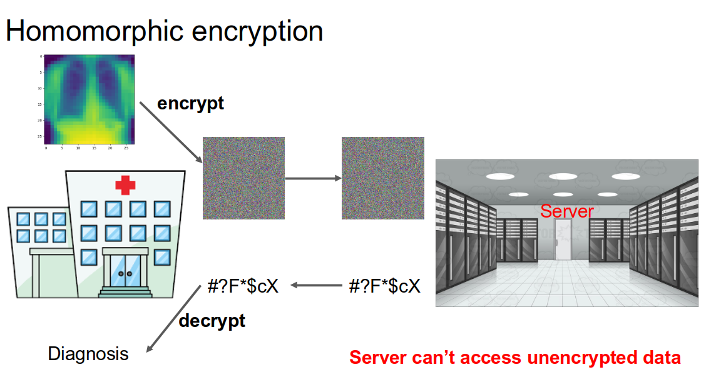
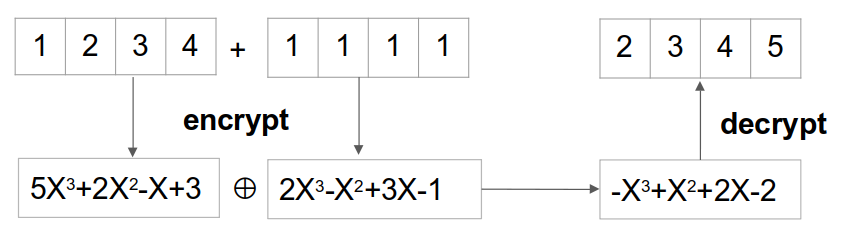
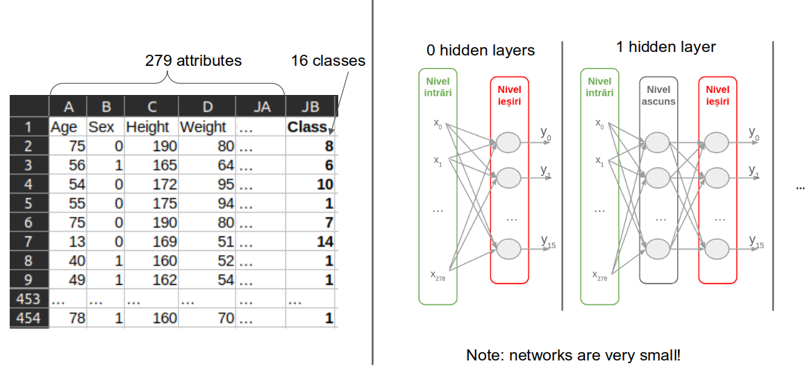
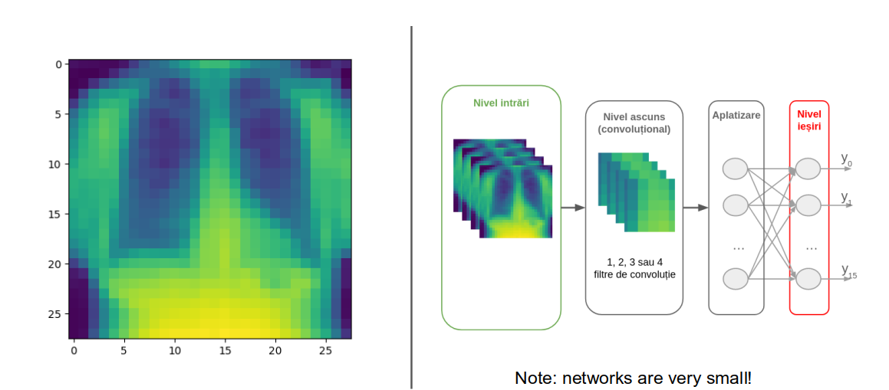

<h1>HEComparison - Homomorphic Encryption libraries comparison - HELib vs Microsoft SEAL</h1>

[HELib](https://github.com/homenc/HElib) and [Microsoft SEAL](https://github.com/microsoft/SEAL) are the most popular Homomorphic Encryption (HE) libraries. But which one is better for running neural networks?

- [Introduction](#introduction)
  - [Why use Homomorphic Encryption?](#why-use-homomorphic-encryption)
  - [How does Homomorphic Encryption work?](#how-does-homomorphic-encryption-work)
    - [Limitations of Homomorphic Encryption](#limitations-of-homomorphic-encryption)
- [Testing scenarios](#testing-scenarios)
  - [Scenario 1: diagnosis from heart attribute measurements](#scenario-1-diagnosis-from-heart-attribute-measurements)
  - [Scenario 2: diagnosis from chest XRays](#scenario-2-diagnosis-from-chest-xrays)
- [Results summary](#results-summary)
- [How to install](#how-to-install)
  - [Download datasets and run the model](#download-datasets-and-run-the-model)
- [Acknowledgements](#acknowledgements)

# Introduction

## Why use Homomorphic Encryption?

When dealing with sensitive information, most applications use end-to-end encryption during data transfer. For example, a medical cloud application may process XRays and reply with a possible diagnosis.

The XRay image and diagnosis cannot be seen by anyone in the middle.

**Homomorphic Encryption (HE)** is the "holy grail" of confidentiality: **allows operations on encrypted data**.

## How does Homomorphic Encryption work?

The current schemes encrypt multiple numbers in a polynomial. The two polinomials are added in a special way. [This YouTube video from Wei Dai (Microsoft)](https://www.youtube.com/watch?v=SEBdYXxijSo&feature=youtu.be) explains the math concepts behind homomorphic encryption.

### Limitations of Homomorphic Encryption
- **Only addition and multiplications are allowed!**
- Operations are much slower and consume more memory than the standard operations
- The number of operations is limited (too many operations make the result impossible to decrypt)

# Testing scenarios

## Scenario 1: diagnosis from heart attribute measurements

See [info.txt](datasets/arrhythmia/info.txt) for dataset details.

## Scenario 2: diagnosis from chest XRays

See [info.txt](datasets/chestmnist/info.txt) for dataset details.

# Results summary

- **Accuracy**: HELib is less accurate after doing many operations, and produces wrong results without throwing any error (silent failures). On the other hand, SEAL is reliable.
- **Running time**: HELib is ~6x times faster than Microsoft SEAL
- **Memory**: HELib requires slightly less memory than SEAL.
- **Usability**: Both can run simple neural networks, but neither one of them is practical for Convolutional Neural Networks.

# How to install

Host system: Ubuntu 22.04.

- `git clone https://github.com/cristipiticul/HEComparison.git`
- `cd HEComparison/dependencies/`
- `sudo ./config_system.sh`
- `./install_dependencies.sh`
  - If you get the error `cc1plus: error: bad value (‘tigerlake’) for ‘-march=’ switch`
    - `sudo apt install gcc-10 g++-10`
    - `sudo update-alternatives --install /usr/bin/gcc gcc /usr/bin/gcc-10 100 --slave /usr/bin/g++ g++ /usr/bin/g++-10 --slave /usr/bin/gcov gcov /usr/bin/gcov-10`
    - `sudo update-alternatives --config gcc`
- `cd ../python`
- `pip install -e ../python`
- `cd ../Debug`
- `make` -> This builds a static library `libkalypso.a` which other projects can link against.
- Run the examples:
  - `sudo apt-get install lib ntl-dev libgmp-dev`
  - `cd ../examples/mnist_cnn/`
  - `python mnist_cnn.py`
  - `cd ../..`
  - `./examples/minst_cnn_example`

## Download datasets and run the model

Go to `datasets/arrythmia` and `datasets/mnist` folders and download there the dataset specified in `info.txt` file.

Run `python/training/preproc_arrhythmia.py` and `python/training/preproc_medmnist_chest.py` to preprocess the datasets.

Go to `tests/test_comp_performance/` and use `3_arrhythmia.sh` to train multiple networks for the tabular dataset (Scenario 1), or `5_chestminst.sh` for the image dataset (Scenario 2)

# Acknowledgements

None of this work would have been possible without [CryptoDL](https://github.com/inspire-lab/CryptoDL) - an open-source library for running neural networks with HELib. This repository is a fork of CryptoDL which adds support for Microsoft SEAL and adds scripts for performance testing.

This is the source code of the Dissertation Thesis "Studiu comparativ al bibliotecilor de criptare homomorfica in contextul retelelor neuronale" supervised by Alin Suciu to whom I'm deeply grateful.
